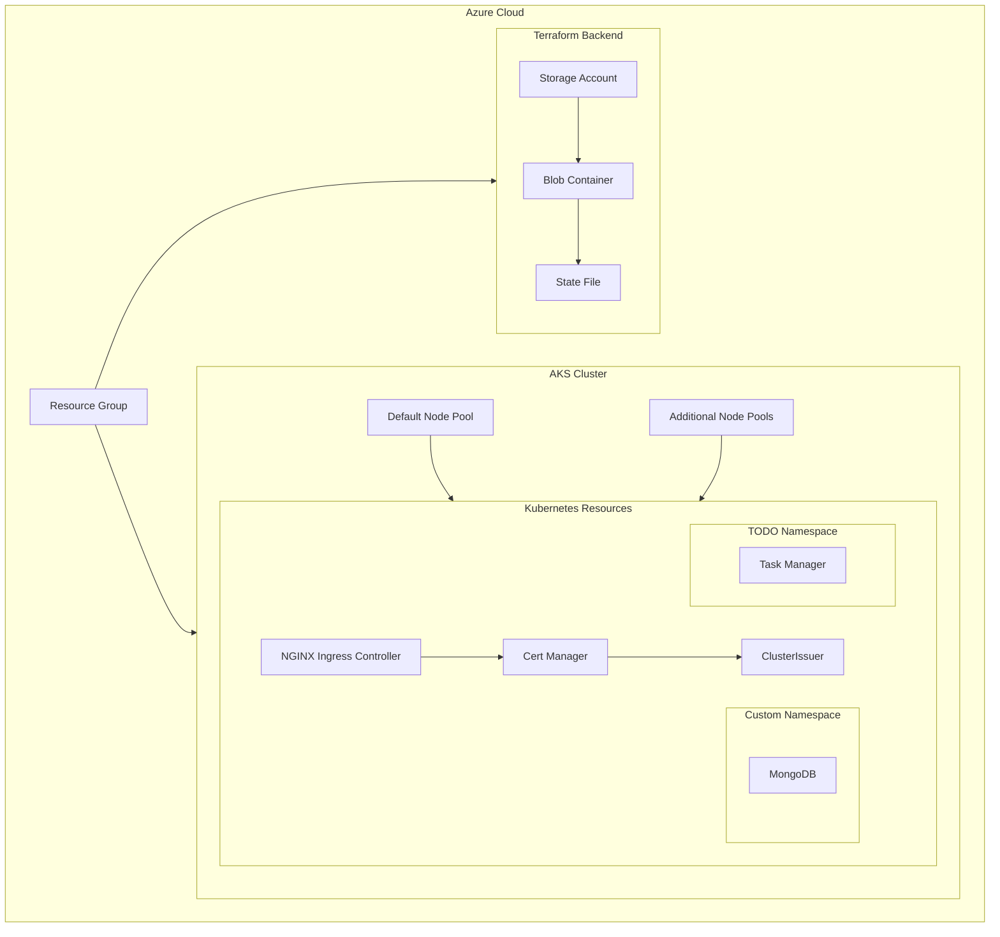

# Sample Application with Infrastructure

This repository contains a sample application with its infrastructure setup using Terraform and Kubernetes on Azure. The setup includes an Azure Kubernetes Service (AKS) cluster, necessary Kubernetes resources, and deployment scripts.

## Table of Contents
- [Architecture](#architecture)
- [Prerequisites](#prerequisites)
- [Setup Instructions](#setup-instructions)
  - [1. Install Required Tools](#1-install-required-tools)
  - [2. Configure Azure Backend](#2-configure-azure-backend)
  - [3. Initialize and Apply Terraform](#3-initialize-and-apply-terraform)
- [Deployment](#deployment)
- [Cleanup](#cleanup)
- [File Structure](#file-structure)

## Architecture



## Prerequisites

- Azure CLI
- Terraform
- Ansible
- Curl
- Wget

## Setup Instructions

### 1. Install Required Tools

Run the following script to install Terraform, Ansible, Curl, and Wget:

```bash
cd infra/deployment-scripts-manifest
./install_tools.sh
```

### 2. Configure Azure Backend

Run the following script to set up the Azure backend storage for Terraform state:

```bash
cd infra/azure
./setup-backend.sh
```

### 3. Initialize and Apply Terraform

Run the following script to initialize and apply the Terraform configuration:

```bash
cd infra/azure
./init.sh
terraform apply -auto-approve
```

## Single Command for Deployment and Cleanup

To deploy the infrastructure and application, run the following script:

```bash
cd infra/deployment-scripts-manifest
./deploy.sh
```

## Cleanup

To destroy the infrastructure, run the following script:

```bash
cd infra/deployment-scripts-manifest
./cleanup.sh
```

## File Structure

```
punitkashyup-sample-application-with-infra/
├── Readme.md
└── infra/
    ├── azure/
    │   ├── backend.hcl
    │   ├── backend.tf
    │   ├── init.sh
    │   ├── main.tf
    │   ├── setup-backend.sh
    │   ├── variables.tf
    │   ├── .gitignore
    │   └── modules/
    │       ├── aks/
    │       │   ├── kubeconfig
    │       │   ├── main.tf
    │       │   ├── outputs.tf
    │       │   └── variables.tf
    │       ├── kubernetes_resources/
    │       │   ├── main.tf
    │       │   ├── outputs.tf
    │       │   └── variables.tf
    │       └── resource_group/
    │           ├── main.tf
    │           ├── outputs.tf
    │           └── variables.tf
    └── deployment-scripts-manifest/
        ├── cleanup.sh
        ├── deploy.sh
        ├── install_tools.sh
        └── deployment-manifest/
            ├── be-ingress.yml
            ├── fe-ingress.yml
            └── secrets.yml
```

## Notes

- Ensure that you have the necessary permissions to create and manage Azure resources.
- Update the Kubernetes manifests and Terraform variables as per your requirements.